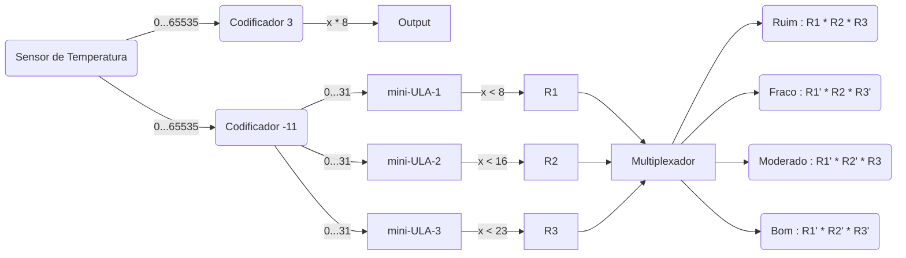
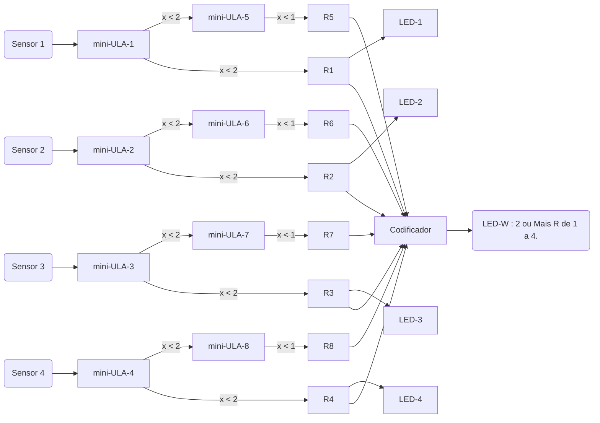

# SolarQuality

# Grupo

| Nome                          | RA      | Email                    |
| ----------------------------- | ------- | ------------------------ |
| João Vinicius Farah Colombini | 159.501 | jvfcolombini@unifesp.br  |
| Victor Jorge Carvalho Chaves  | 156.740 | victor.chaves@unifesp.br |
| Enzo Soares e Silva Cerávolo  | 159.319 | enzo.ceravolo@unifesp.br |
| David Aaron Medeiro           |         |                          |

# Fundamentos

- ## [Irradiação (SI)](https://en.wikipedia.org/wiki/Irradiance#:~:text=The%20SI%20unit%20of%20irradiance,to%20confusion%20with%20radiant%20intensity)

- ## [Resistencia de Calor da Placa Solar](https://www.eco-greenenergy.com/pt-pt/o-clima-afetara-a-eficiencia-do-painel-solar/#:~:text=Como%20todos%20sabemos%2C%20os%20pain%C3%A9is,durante%20o%20ver%C3%A3o%20e%20inverno.)

- ## [Conversão de Lux para $W/m²$](https://fenix.tecnico.ulisboa.pt/downloadFile/1970719973966843/MasterThesis_70481.pdf)
  
$$R = L \times 8$$
$$L :\text{Luminosidade (lx ou lux)}$$
$$R : \frac{mW}{m²} : \frac{\text{ mili watts}}{\text{metro²}}$$

# Descrição

A partir da ODS 7 foi abstraída a ideia de desenvolver um projeto em circuitos digitais de maneira teórica para obtenção da qualidade de um território para a instalação de painéis solares. Isto é verificar tanto a procedência da área a colocar os painéis e também se existe uma quantidade aceitável luminosidade solar.

## **Sensores Utilizados**
- **Sensor de Luminosidade** 
    - Modelo : [BH1750](https://imasters.com.br/desenvolvimento/como-funciona-o-sensor-de-luz-bh1750)
    - Função : Mede a luminosidade em [lux (simbolo lx)](https://en.wikipedia.org/wiki/Lux).
    - Saída : 0 a 65535 (16 bits), que são em lux.
    - Saída Adaptada : 0 a 31 (5 bits), que são em $\frac{lx}{4096}$.

- **Sensor de Temperatura** 
  - Modelo : [LM35](https://blogmasterwalkershop.com.br/arduino/como-usar-com-arduino-sensor-de-temperatura-lm35)
  - Função : Medir Temperatura
  - Saída : 0 a 100 ºC
  - Saída Adaptada : 0 a 63 ºC (6 bits)

- **Sensor de Peso** 
  - Modelo : [Célula de Carga](https://www.robocore.net/tutoriais/celula-de-carga-hx711-com-arduino)
  - Função : Medir o peso sobre ele
  - Saída : 0 até 50kg
  - Saída Adaptada : 0 a 31 kg (5 bits)

# Funcionamento do Sistema

## Processamento

- ### Calculo da Qualidade de Luminosidade

- ### Verificação da Instalação

## Saídas

- ### Qualidade da Luminosidade 
  - Ruim : 0 a 25% do máximo de luminosidade 
  - Fraco : 25% a 50% do máximo de luminosidade 
  - Moderado : 50% a 75% do máximo de luminosidade
  - Bom : 75% a 100% do máximo de luminosidade

- ### Qualidade de Instalação
  - Acender cada led referente ao pé, se ele estiver ruim.
  - Se 2 ou mais estiverem ruins, alerta.

- ### Situação da Temperatura
  - Boa : 15ºC < Temperatura < 35ºC
  - Ruim : (Temperatura < 15ºC) ou (35ºC < Temperatura)
